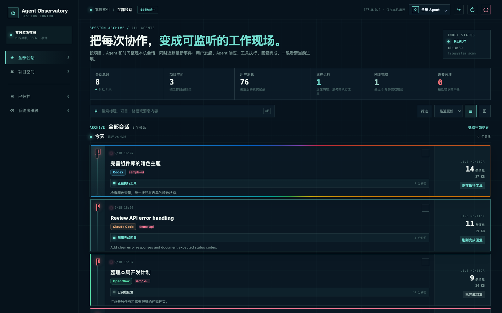

# Agent Observatory

[](https://github.com/zty-f/agent-observatory/actions/workflows/checks.yml)

[English](README.md) · [简体中文](README.zh-CN.md)

A local dashboard for finding, reading, and managing coding-agent sessions across Codex, Claude Code, OpenClaw, and Pi.

Agent Observatory scans session files on your Mac and groups them by project and agent. It shows recent recorded activity, lets you search conversations, and provides recoverable Trash actions where the agent's state can be handled safely. It does not run agents or call model APIs.



*Demo screenshot with synthetic sessions; no personal history is shown.*

## Quick start

**Requirements:** macOS, Node.js 22 or newer, and at least one supported agent with local sessions. There are no runtime npm dependencies.

```bash
git clone https://github.com/zty-f/agent-observatory.git
cd agent-observatory
npm start
```

Open <http://127.0.0.1:4180>. The server binds to `127.0.0.1`; keep the dashboard on your own machine. It has no user authentication, so do not port-forward it or place it behind a public proxy.

For a per-user macOS background service, run `./start.sh`; stop that service with `./stop.sh` or the dashboard power button. These scripts target Agent Observatory, not the agent processes. To change the port, use `AGENT_OBSERVATORY_PORT=4181 npm start`.

## What it does

- Search sessions by title, agent, project, path, and message summary; read the recorded conversation locally.
- Group sessions by detected working directory and show recent JSONL events. “Running” is an inference from recent writes, not a process or provider health check.
- Archive Codex sessions, move eligible sessions to macOS Trash, restore them (to the original path when available), or explicitly delete Trash entries.
- Copy `codex resume` and `claude --resume` commands for supported sessions.
- Refresh the browser view every eight seconds. The interface has light/dark themes and list/grid views.

| Agent | Session source | Trash / restore from this dashboard | Resume command |
| --- | --- | --- | --- |
| Codex | `~/.codex/sessions`, `~/.codex/archived_sessions` | Session file, native index/history, and desktop catalog | Yes |
| Claude Code | `~/.claude/projects/**/*.jsonl` | Session file | Yes |
| OpenClaw | `~/.openclaw/agents/**/sessions/*.jsonl` | Unrouted history files only | No |
| Pi | `~/.pi/agent/sessions/**/*.jsonl` | Session file | No |

OpenClaw sessions referenced by a live `sessions.json` route are **blocked from Trash**: moving only their JSONL would leave a broken route. Codex's persistent records are updated by this dashboard, but an already-open ChatGPT/Codex window may keep an in-memory sidebar entry until it is fully quit and reopened. File actions for Claude Code and Pi do not promise immediate refresh of their running clients. See [privacy and data handling](PRIVACY.md) for the full boundary.

For custom Pi locations, set `PI_CODING_AGENT_DIR` (agent directory) or `PI_CODING_AGENT_SESSION_DIR` (session directory); the latter takes precedence.

## Safety and privacy

The dashboard reads local prompts, replies, tool output, timestamps, and paths. Those records may contain secrets. No account, telemetry, cookies, external fonts, or model API calls are built into Agent Observatory. Session data is returned only to the local browser over its local HTTP API. Browser preferences are stored in `localStorage`; Trash metadata and optional Codex snapshots stay on the Mac. The server does not authenticate local users, and deleting an item here does not erase copies held by other software, backups, or an open client's memory.

Read the [Privacy Notice](PRIVACY.md) ([中文](PRIVACY.zh-CN.md)) and [Security Policy](SECURITY.md) before sharing screenshots, logs, or access to the dashboard. **Never attach raw session files to a public issue.**

## API and development

The local UI uses `GET /api/health`, `/api/agents`, `/api/sessions`, `/api/conversation/:id`, and `POST /api/action`. The server accepts only local Host names and same-origin browser requests. This API is for local integrations; it is not a remotely authenticated service.

```bash
npm test
npm start
```

`npm test` checks the JavaScript syntax and runs focused HTTP privacy/security tests. The app uses Node's built-in HTTP server and browser JavaScript. `server.js` reads session files and performs actions; `app.js` renders the UI; `codex-trash-state.py` snapshots and restores Codex metadata; `start.sh` and `stop.sh` manage the macOS service.

## Contributing and support

Read [CONTRIBUTING.md](CONTRIBUTING.md) and the [Code of Conduct](CODE_OF_CONDUCT.md) before opening a pull request. Use the [issue templates](https://github.com/zty-f/agent-observatory/issues/new/choose) for bugs and ideas; remove personal paths and session content from examples. Report vulnerabilities privately as described in [SECURITY.md](SECURITY.md).

The project is currently macOS-focused. Agent formats and desktop indexes can change; support for a new agent or a delete/restore path needs evidence from that agent's current format and a round-trip test. See the [license](LICENSE) for reuse terms.
